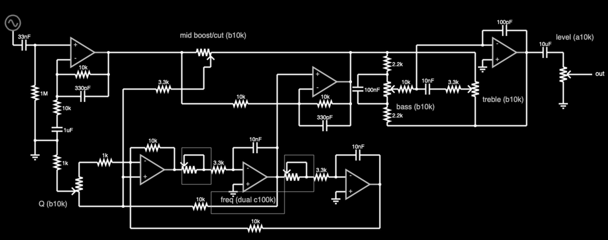

* Parseq (Parametric Equalizer)

/(Par)ametric + (s)helving (eq)ualizer ⇒ Parseq/

An equalizer (EQ) effect is an understated workhorse. It expands the capabilities of your existing pedals, can fix sonic problems with surgical precision, or simply add a different color to your palette.

Graphic EQs can't be beat for their easy-to-use interface, but all those sliders take up a lot of space and cutting long slots in an enclosure isn't as DIY-friendly as a design with rotary knobs.

Fully parametric EQs are still EQs but in practice they fill a different niche than a graphic EQ. Rather than constructing a frequency response graph, a fully parametric EQ excels at pinpointing a specific frequency to cut or boost with precision.

[[https://www.falstad.com/afilter/circuitjs.html?cct=$+1+0.000005+5+50+5+50%0A%25+0+20615.097787781793%0AO+1264+208+1312+208+0%0A170+32+144+32+96+3+20+1000+5+0.1%0Aa+288+416+384+416+0+15+-15+1000000%0Aa+512+432+608+432+0+15+-15+1000000%0Aa+656+224+768+224+1+15+-15+1000000%0Aw+656+240+656+272+0%0Ar+656+272+768+272+0+10000%0Aw+768+272+768+224+0%0A174+496+160+400+192+0+10000+0.005+mids+(10k)%0Ar+448+240+272+240+0+3300%0Aw+272+240+272+432+0%0Ag+512+448+512+464+0%0Aw+272+432+288+432+0%0Aw+288+400+288+368+0%0Ar+288+368+384+368+0+10000%0Aw+384+368+384+416+0%0Ar+288+400+176+400+0+1000%0A174+176+400+128+496+0+10000+0.9950000000000001+Q+(10k)%0Ar+128+448+128+352+0+1000%0Ar+448+416+512+416+0+3300%0Aw+512+416+512+368+0%0Ac+512+368+608+368+0+1e-8+0%0Aw+608+368+608+432+0%0Aw+416+384+448+384+0%0Aw+448+384+448+416+0%0Aw+672+400+672+432+0%0Aw+640+400+672+400+0%0Aw+832+384+832+448+0%0Ac+736+384+832+384+0+1e-8+0%0Aw+736+432+736+384+0%0Ar+672+432+736+432+0+3300%0Ag+736+464+736+480+0%0Aa+736+448+832+448+0+15+-15+1000000%0Aw+832+448+832+544+0%0Ar+832+544+288+544+0+10000%0Aw+288+544+288+400+0%0Aw+400+160+400+272+0%0Ar+400+272+656+272+0+10000%0Aw+496+160+768+160+0%0Aw+768+160+768+224+0%0Aw+608+368+608+208+0%0Aw+608+208+656+208+0%0Aw+608+432+608+496+0%0Ar+608+496+272+496+0+10000%0Aw+176+496+272+496+0%0A174+672+432+608+400+0+100000+0.8465+f2+(100k)%0A174+448+416+384+384+0+100000+0.8465+f1+(100k)%0Aa+128+160+240+160+1+15+-15+1000000%0Ac+32+144+80+144+0+3.3e-8+0%0Ar+80+144+80+352+0+1000000%0Ag+80+352+80+384+0%0Aw+128+176+128+208+0%0Ar+128+208+240+208+0+10000%0Aw+240+208+240+160+0%0Ar+128+256+128+304+0+10000%0Ac+128+304+128+352+0+0.000001+0%0Aw+128+352+80+352+0%0Aw+80+144+128+144+0%0Aw+240+160+400+160+0%0Ac+1152+160+1232+160+0+0.00001+0%0Ag+1232+256+1232+272+0%0A174+1232+256+1264+160+0+10000+0.5+level+(10k)%0Aw+656+272+656+320+0%0Ac+656+320+768+320+0+3.3e-10+0%0Aw+768+272+768+320+0%0Ac+128+256+240+256+0+3.3e-10+0%0Aw+240+208+240+256+0%0Aw+128+208+128+256+0%0Aw+448+192+448+240+0%0Aw+272+432+272+496+0%0Aa+1056+160+1152+160+0+15+-15+1000000%0Ag+1056+176+1056+192+0%0Aw+1056+144+1056+112+0%0Ac+1056+112+1152+112+0+1e-10+0%0Aw+1152+112+1152+160+0%0A174+1040+272+1024+208+0+10000+0.5+treble+(10k)%0A174+848+272+864+208+0+10000+0.5+bass+(10k)%0Ar+848+208+848+160+0+2200%0Ar+848+272+848+320+0+2200%0Aw+848+272+784+272+0%0Ac+784+272+784+208+0+1e-7+0%0Aw+784+208+848+208+0%0Ar+864+240+912+240+0+10000%0Ac+912+240+960+240+0+1e-8+0%0Ar+960+240+1024+240+0+3300%0Aw+912+240+912+144+0%0Aw+912+144+1056+144+0%0Aw+1040+208+1040+160+0%0Aw+1040+160+848+160+0%0Aw+848+160+768+160+0%0Aw+848+320+1040+320+0%0Aw+1040+272+1040+320+0%0Aw+1040+320+1152+320+0%0Aw+1152+160+1152+320+0%0Ax+88+496+150+499+0+16+Q+(b10k)%0Ax+396+128+540+131+0+16+mid+boost/cut+(b10k)%0AB+400+368+464+448+2+Box%0AB+624+384+688+464+2+Box%0Ax+485+487+605+490+0+16+freq+(dual+c100k)%0AB+464+464+624+512+2+Box%0Ax+868+284+951+287+0+16+bass+(b10k)%0Ax+1056+268+1145+271+0+16+treble+(b10k)%0Ax+1216+132+1298+135+0+16+level+(a10k)%0Ao+1+16+0+34+5+0.00009765625+0+-1+in%0Ao+0+16+0+34+2.5+0.00009765625+1+-1+out%0A][This design]] takes a lot of inspiration from [[https://bentfishbowl.wixsite.com/electronics/post/core-shaper][Dylan's Core Shaper]], another EQ with a parametric midrange. The Core Shaper is a simpler design (only 4 op-amps required) with a semi-parametric midrange control based on a Wein bridge filter. The mid sweep of the Core Shaper extends from about 310Hz to 3.2kHz. The Q in the Core Shaper is switchable from low (~0.3) to high (~0.8)

#+caption: Parseq schematic

NOTE: table contains *simulated* values

| mid parameter  | Core Shaper | Parseq |
|----------------+-------------+--------|
| min freq (Hz)  |         311 |    155 |
| max freq (Hz)  |        3220 |   4180 |
| min Q          |         0.3 |    0.3 |
| max Q          |         0.8 |    2.4 |
| max boost (dB) |          16 |     15 |
| max cut (dB)   |         -16 |    -16 |

By contrast, the Parseq uses a state variable filter for the midrange which gives it a wider bandwidth sweep as well as continuous control over the Q factor instead of a 2-mode switch. The downside of this design is it requires more components.

Besides the mid filter, the Parseq takes nearly all of its design cues from the Core Shaper:

1. input fixed gain stage
2. parametric midrange
3. Baxandall treble/bass shelving filters
4. passive output attenuator for volume control

Use the Parseq when you want more precision than the Core Shaper and don't mind the extra circuit complexity.
